# Pymaceuticals Inc.


```python
import pandas as pd
import numpy as np
import matplotlib.pyplot as plt
import seaborn as sns
```

## Data Munging


```python
trial = pd.read_csv('clinicaltrial_data.csv')
mice = pd.read_csv('mouse_drug_data.csv')
combined = trial.merge(mice, how='outer')
print(combined.Drug.unique())
combined.head(20)
```

    ['Capomulin' 'Ketapril' 'Naftisol' 'Infubinol' 'Stelasyn' 'Ramicane'
     'Propriva' 'Zoniferol' 'Placebo' 'Ceftamin']


<div>
<style scoped>
    .dataframe tbody tr th:only-of-type {
        vertical-align: middle;
    }

    .dataframe tbody tr th {
        vertical-align: top;
    }

    .dataframe thead th {
        text-align: right;
    }
</style>
<table border="1" class="dataframe">
  <thead>
    <tr style="text-align: right;">
      <th></th>
      <th>Mouse ID</th>
      <th>Timepoint</th>
      <th>Tumor Volume (mm3)</th>
      <th>Metastatic Sites</th>
      <th>Drug</th>
    </tr>
  </thead>
  <tbody>
    <tr>
      <th>0</th>
      <td>b128</td>
      <td>0</td>
      <td>45.000000</td>
      <td>0</td>
      <td>Capomulin</td>
    </tr>
    <tr>
      <th>1</th>
      <td>b128</td>
      <td>5</td>
      <td>45.651331</td>
      <td>0</td>
      <td>Capomulin</td>
    </tr>
    <tr>
      <th>2</th>
      <td>b128</td>
      <td>10</td>
      <td>43.270852</td>
      <td>0</td>
      <td>Capomulin</td>
    </tr>
    <tr>
      <th>3</th>
      <td>b128</td>
      <td>15</td>
      <td>43.784893</td>
      <td>0</td>
      <td>Capomulin</td>
    </tr>
    <tr>
      <th>4</th>
      <td>b128</td>
      <td>20</td>
      <td>42.731552</td>
      <td>0</td>
      <td>Capomulin</td>
    </tr>
    <tr>
      <th>5</th>
      <td>b128</td>
      <td>25</td>
      <td>43.262145</td>
      <td>1</td>
      <td>Capomulin</td>
    </tr>
    <tr>
      <th>6</th>
      <td>b128</td>
      <td>30</td>
      <td>40.605335</td>
      <td>1</td>
      <td>Capomulin</td>
    </tr>
    <tr>
      <th>7</th>
      <td>b128</td>
      <td>35</td>
      <td>37.967644</td>
      <td>1</td>
      <td>Capomulin</td>
    </tr>
    <tr>
      <th>8</th>
      <td>b128</td>
      <td>40</td>
      <td>38.379726</td>
      <td>2</td>
      <td>Capomulin</td>
    </tr>
    <tr>
      <th>9</th>
      <td>b128</td>
      <td>45</td>
      <td>38.982878</td>
      <td>2</td>
      <td>Capomulin</td>
    </tr>
    <tr>
      <th>10</th>
      <td>f932</td>
      <td>0</td>
      <td>45.000000</td>
      <td>0</td>
      <td>Ketapril</td>
    </tr>
    <tr>
      <th>11</th>
      <td>g107</td>
      <td>0</td>
      <td>45.000000</td>
      <td>0</td>
      <td>Ketapril</td>
    </tr>
    <tr>
      <th>12</th>
      <td>g107</td>
      <td>5</td>
      <td>48.791665</td>
      <td>0</td>
      <td>Ketapril</td>
    </tr>
    <tr>
      <th>13</th>
      <td>g107</td>
      <td>10</td>
      <td>53.435987</td>
      <td>0</td>
      <td>Ketapril</td>
    </tr>
    <tr>
      <th>14</th>
      <td>g107</td>
      <td>15</td>
      <td>58.135545</td>
      <td>0</td>
      <td>Ketapril</td>
    </tr>
    <tr>
      <th>15</th>
      <td>g107</td>
      <td>20</td>
      <td>62.706031</td>
      <td>0</td>
      <td>Ketapril</td>
    </tr>
    <tr>
      <th>16</th>
      <td>g107</td>
      <td>25</td>
      <td>64.663626</td>
      <td>0</td>
      <td>Ketapril</td>
    </tr>
    <tr>
      <th>17</th>
      <td>g107</td>
      <td>30</td>
      <td>69.160520</td>
      <td>0</td>
      <td>Ketapril</td>
    </tr>
    <tr>
      <th>18</th>
      <td>g107</td>
      <td>35</td>
      <td>71.905117</td>
      <td>0</td>
      <td>Ketapril</td>
    </tr>
    <tr>
      <th>19</th>
      <td>a457</td>
      <td>0</td>
      <td>45.000000</td>
      <td>0</td>
      <td>Ketapril</td>
    </tr>
  </tbody>
</table>
</div>


## Tumor Volume Over Time


```python
timepoints = combined.Timepoint.unique()
drugs = combined.Drug.unique()
tumor_volume = pd.DataFrame(index = timepoints, columns = drugs)
tumor_volume_sem = pd.DataFrame(index = timepoints, columns = drugs)

for drug in drugs:
    tumor_volume[drug] = [combined[(combined["Drug"] == drug) & (combined["Timepoint"] == time)]['Tumor Volume (mm3)'].mean() for time in timepoints]
    tumor_volume_sem[drug] = [combined[(combined["Drug"] == drug) & (combined["Timepoint"] == time)]['Tumor Volume (mm3)'].sem() for time in timepoints]
    
tumor_volume.index.name = 'Timepoints'
tumor_volume.columns.name = 'Drugs'
      
tumor_volume_sem.head(10)


```


<div>
<style scoped>
    .dataframe tbody tr th:only-of-type {
        vertical-align: middle;
    }

    .dataframe tbody tr th {
        vertical-align: top;
    }

    .dataframe thead th {
        text-align: right;
    }
</style>
<table border="1" class="dataframe">
  <thead>
    <tr style="text-align: right;">
      <th></th>
      <th>Capomulin</th>
      <th>Ketapril</th>
      <th>Naftisol</th>
      <th>Infubinol</th>
      <th>Stelasyn</th>
      <th>Ramicane</th>
      <th>Propriva</th>
      <th>Zoniferol</th>
      <th>Placebo</th>
      <th>Ceftamin</th>
    </tr>
  </thead>
  <tbody>
    <tr>
      <th>0</th>
      <td>0.000000</td>
      <td>0.000000</td>
      <td>0.000000</td>
      <td>0.000000</td>
      <td>0.000000</td>
      <td>0.000000</td>
      <td>0.000000</td>
      <td>0.000000</td>
      <td>0.000000</td>
      <td>0.000000</td>
    </tr>
    <tr>
      <th>5</th>
      <td>0.448593</td>
      <td>0.264819</td>
      <td>0.202385</td>
      <td>0.235102</td>
      <td>0.239862</td>
      <td>0.482955</td>
      <td>0.231708</td>
      <td>0.188950</td>
      <td>0.218091</td>
      <td>0.164505</td>
    </tr>
    <tr>
      <th>10</th>
      <td>0.702684</td>
      <td>0.357421</td>
      <td>0.319415</td>
      <td>0.282346</td>
      <td>0.433678</td>
      <td>0.720225</td>
      <td>0.376195</td>
      <td>0.263949</td>
      <td>0.402064</td>
      <td>0.236144</td>
    </tr>
    <tr>
      <th>15</th>
      <td>0.838617</td>
      <td>0.580268</td>
      <td>0.444378</td>
      <td>0.357705</td>
      <td>0.493261</td>
      <td>0.770432</td>
      <td>0.466109</td>
      <td>0.370544</td>
      <td>0.614461</td>
      <td>0.332053</td>
    </tr>
    <tr>
      <th>20</th>
      <td>0.909731</td>
      <td>0.726484</td>
      <td>0.595260</td>
      <td>0.476210</td>
      <td>0.621889</td>
      <td>0.786199</td>
      <td>0.555181</td>
      <td>0.533182</td>
      <td>0.839609</td>
      <td>0.359482</td>
    </tr>
    <tr>
      <th>25</th>
      <td>0.881642</td>
      <td>0.755413</td>
      <td>0.813706</td>
      <td>0.550315</td>
      <td>0.741922</td>
      <td>0.746991</td>
      <td>0.577401</td>
      <td>0.602513</td>
      <td>1.034872</td>
      <td>0.439356</td>
    </tr>
    <tr>
      <th>30</th>
      <td>0.934460</td>
      <td>0.934121</td>
      <td>0.975496</td>
      <td>0.631061</td>
      <td>0.899548</td>
      <td>0.864906</td>
      <td>0.746045</td>
      <td>0.800043</td>
      <td>1.218231</td>
      <td>0.490620</td>
    </tr>
    <tr>
      <th>35</th>
      <td>1.052241</td>
      <td>1.127867</td>
      <td>1.013769</td>
      <td>0.984155</td>
      <td>1.003186</td>
      <td>0.967433</td>
      <td>1.084929</td>
      <td>0.881426</td>
      <td>1.287481</td>
      <td>0.692248</td>
    </tr>
    <tr>
      <th>40</th>
      <td>1.223608</td>
      <td>1.158449</td>
      <td>1.118567</td>
      <td>1.055220</td>
      <td>1.410435</td>
      <td>1.128445</td>
      <td>1.564779</td>
      <td>0.998515</td>
      <td>1.370634</td>
      <td>0.708505</td>
    </tr>
    <tr>
      <th>45</th>
      <td>1.223977</td>
      <td>1.453186</td>
      <td>1.416363</td>
      <td>1.144427</td>
      <td>1.576556</td>
      <td>1.226805</td>
      <td>1.888586</td>
      <td>1.003576</td>
      <td>1.351726</td>
      <td>0.902358</td>
    </tr>
  </tbody>
</table>
</div>


### Plotting Function


```python
def plot_func(df, errors, title, y_label):#error_q is a boolean that determines whether the function adds
    # error bars since not all of our plots can support them
    drugs_array = [[drugs[0],drugs[1],drugs[8],drugs[2]], \
               [drugs[3],drugs[4],drugs[8]], \
               [drugs[5],drugs[6],drugs[8]],\
               [drugs[7],drugs[9],drugs[8]]]
#list of lists for our separate plots
    for i in range(1,5):
        plt.figure()
        sns.set_style("dark")
        for drug in df[drugs_array[i-1]]:
            if type(errors) == bool:
                plt.scatter(df.index.values, df[drug])
            else:
                plt.errorbar(df.index.values, df[drug], yerr= errors[drug], fmt='o', elinewidth=3)
        plt.legend(drugs_array[i-1])      
        plt.title(title)
        plt.xlabel('Time (Days)')
        plt.ylabel(y_label)
    
    return
```


```python
plot_func(tumor_volume, tumor_volume_sem,'Tumor Volume Over Time','Tumor Volume (mm**3)')
```


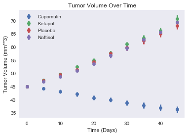


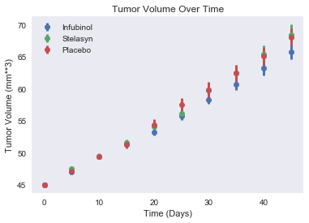


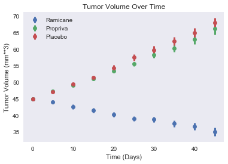


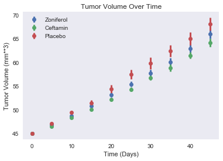


Just a heads up, I broke these into four separate plots to be a little more aesthetic. According to this data, the only two drugs that statistically outperform the placebo are Capomulin and Ramicane. You may notice in the first plot that in the top right corner the drugs Naftisol and Ketapril appear to be making the mouse sicker! This is not the case, because the error bars are too close together. This is statistical variation in the mice.

## Metastatic Sites Over Time


```python
metastatic_sites = pd.DataFrame(index = timepoints, columns = drugs)
metastatic_sites_sem = pd.DataFrame(index = timepoints, columns = drugs)
for drug in drugs:
    metastatic_sites[drug] = [combined[(combined["Drug"] == drug) & (combined["Timepoint"] == time)]['Metastatic Sites'].mean() for time in timepoints]
    metastatic_sites_sem[drug] = [combined[(combined["Drug"] == drug) & (combined["Timepoint"] == time)]['Metastatic Sites'].sem() for time in timepoints]
metastatic_sites.index.name = 'Timepoints'
metastatic_sites.columns.name = 'Drugs'    
metastatic_sites.head(10)


```


<div>
<style scoped>
    .dataframe tbody tr th:only-of-type {
        vertical-align: middle;
    }

    .dataframe tbody tr th {
        vertical-align: top;
    }

    .dataframe thead th {
        text-align: right;
    }
</style>
<table border="1" class="dataframe">
  <thead>
    <tr style="text-align: right;">
      <th>Drugs</th>
      <th>Capomulin</th>
      <th>Ketapril</th>
      <th>Naftisol</th>
      <th>Infubinol</th>
      <th>Stelasyn</th>
      <th>Ramicane</th>
      <th>Propriva</th>
      <th>Zoniferol</th>
      <th>Placebo</th>
      <th>Ceftamin</th>
    </tr>
    <tr>
      <th>Timepoints</th>
      <th></th>
      <th></th>
      <th></th>
      <th></th>
      <th></th>
      <th></th>
      <th></th>
      <th></th>
      <th></th>
      <th></th>
    </tr>
  </thead>
  <tbody>
    <tr>
      <th>0</th>
      <td>0.000000</td>
      <td>0.000000</td>
      <td>0.000000</td>
      <td>0.000000</td>
      <td>0.000000</td>
      <td>0.000000</td>
      <td>0.000000</td>
      <td>0.000000</td>
      <td>0.000000</td>
      <td>0.000000</td>
    </tr>
    <tr>
      <th>5</th>
      <td>0.160000</td>
      <td>0.304348</td>
      <td>0.260870</td>
      <td>0.280000</td>
      <td>0.240000</td>
      <td>0.120000</td>
      <td>0.320000</td>
      <td>0.166667</td>
      <td>0.375000</td>
      <td>0.380952</td>
    </tr>
    <tr>
      <th>10</th>
      <td>0.320000</td>
      <td>0.590909</td>
      <td>0.523810</td>
      <td>0.666667</td>
      <td>0.478261</td>
      <td>0.250000</td>
      <td>0.565217</td>
      <td>0.500000</td>
      <td>0.833333</td>
      <td>0.600000</td>
    </tr>
    <tr>
      <th>15</th>
      <td>0.375000</td>
      <td>0.842105</td>
      <td>0.857143</td>
      <td>0.904762</td>
      <td>0.782609</td>
      <td>0.333333</td>
      <td>0.764706</td>
      <td>0.809524</td>
      <td>1.250000</td>
      <td>0.789474</td>
    </tr>
    <tr>
      <th>20</th>
      <td>0.652174</td>
      <td>1.210526</td>
      <td>1.150000</td>
      <td>1.050000</td>
      <td>0.952381</td>
      <td>0.347826</td>
      <td>1.000000</td>
      <td>1.294118</td>
      <td>1.526316</td>
      <td>1.111111</td>
    </tr>
    <tr>
      <th>25</th>
      <td>0.818182</td>
      <td>1.631579</td>
      <td>1.500000</td>
      <td>1.277778</td>
      <td>1.157895</td>
      <td>0.652174</td>
      <td>1.357143</td>
      <td>1.687500</td>
      <td>1.941176</td>
      <td>1.500000</td>
    </tr>
    <tr>
      <th>30</th>
      <td>1.090909</td>
      <td>2.055556</td>
      <td>2.066667</td>
      <td>1.588235</td>
      <td>1.388889</td>
      <td>0.782609</td>
      <td>1.615385</td>
      <td>1.933333</td>
      <td>2.266667</td>
      <td>1.937500</td>
    </tr>
    <tr>
      <th>35</th>
      <td>1.181818</td>
      <td>2.294118</td>
      <td>2.266667</td>
      <td>1.666667</td>
      <td>1.562500</td>
      <td>0.952381</td>
      <td>2.300000</td>
      <td>2.285714</td>
      <td>2.642857</td>
      <td>2.071429</td>
    </tr>
    <tr>
      <th>40</th>
      <td>1.380952</td>
      <td>2.733333</td>
      <td>2.466667</td>
      <td>2.100000</td>
      <td>1.583333</td>
      <td>1.100000</td>
      <td>2.777778</td>
      <td>2.785714</td>
      <td>3.166667</td>
      <td>2.357143</td>
    </tr>
    <tr>
      <th>45</th>
      <td>1.476190</td>
      <td>3.363636</td>
      <td>2.538462</td>
      <td>2.111111</td>
      <td>1.727273</td>
      <td>1.250000</td>
      <td>2.571429</td>
      <td>3.071429</td>
      <td>3.272727</td>
      <td>2.692308</td>
    </tr>
  </tbody>
</table>
</div>


```python
plot_func(metastatic_sites,metastatic_sites_sem,'Number of Metastatic Sites Over Time','Number of Metastatic Sites')
```


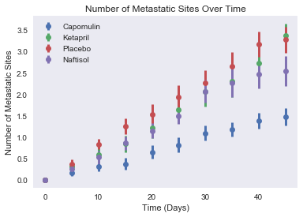


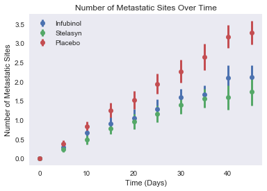


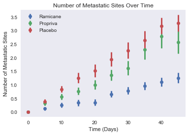


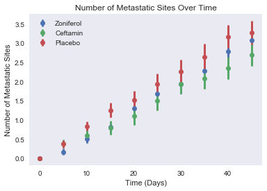


It looks like the error bars on this are much larger as compared with the last plots. This can be explained because of greater variance among this set of data. It appears that Infubinol and Stelasyn appear to be a bit better than the placebo at preventing metastatic sites of tumors, particularly in the longer term. And again, Capomulin and Ramicane are both significantly outperforming the placebo.

## Survival Rate


```python
survival = pd.DataFrame(index = timepoints, columns = drugs)
for drug in drugs:
    survival[drug] = [combined[(combined["Drug"] == drug) & (combined["Timepoint"] == time)]['Mouse ID'].count() for time in timepoints]
survival.index.name = 'Timepoints'
survival.columns.name = 'Drugs'
#error bars aren't possible because this is a count of mice, not average of data
for drug in drugs:
    survival[drug] = (survival[drug]/survival.iloc[0][drug])*100
print(survival.iloc[0]['Capomulin'])
survival.head(10)
```

    100.0


<div>
<style scoped>
    .dataframe tbody tr th:only-of-type {
        vertical-align: middle;
    }

    .dataframe tbody tr th {
        vertical-align: top;
    }

    .dataframe thead th {
        text-align: right;
    }
</style>
<table border="1" class="dataframe">
  <thead>
    <tr style="text-align: right;">
      <th>Drugs</th>
      <th>Capomulin</th>
      <th>Ketapril</th>
      <th>Naftisol</th>
      <th>Infubinol</th>
      <th>Stelasyn</th>
      <th>Ramicane</th>
      <th>Propriva</th>
      <th>Zoniferol</th>
      <th>Placebo</th>
      <th>Ceftamin</th>
    </tr>
    <tr>
      <th>Timepoints</th>
      <th></th>
      <th></th>
      <th></th>
      <th></th>
      <th></th>
      <th></th>
      <th></th>
      <th></th>
      <th></th>
      <th></th>
    </tr>
  </thead>
  <tbody>
    <tr>
      <th>0</th>
      <td>100.0</td>
      <td>100.0</td>
      <td>100.0</td>
      <td>100.0</td>
      <td>100.000000</td>
      <td>100.0</td>
      <td>100.000000</td>
      <td>100.0</td>
      <td>100.0</td>
      <td>100.0</td>
    </tr>
    <tr>
      <th>5</th>
      <td>100.0</td>
      <td>92.0</td>
      <td>92.0</td>
      <td>100.0</td>
      <td>96.153846</td>
      <td>100.0</td>
      <td>96.153846</td>
      <td>96.0</td>
      <td>96.0</td>
      <td>84.0</td>
    </tr>
    <tr>
      <th>10</th>
      <td>100.0</td>
      <td>88.0</td>
      <td>84.0</td>
      <td>84.0</td>
      <td>88.461538</td>
      <td>96.0</td>
      <td>88.461538</td>
      <td>88.0</td>
      <td>96.0</td>
      <td>80.0</td>
    </tr>
    <tr>
      <th>15</th>
      <td>96.0</td>
      <td>76.0</td>
      <td>84.0</td>
      <td>84.0</td>
      <td>88.461538</td>
      <td>96.0</td>
      <td>65.384615</td>
      <td>84.0</td>
      <td>80.0</td>
      <td>76.0</td>
    </tr>
    <tr>
      <th>20</th>
      <td>92.0</td>
      <td>76.0</td>
      <td>80.0</td>
      <td>80.0</td>
      <td>80.769231</td>
      <td>92.0</td>
      <td>65.384615</td>
      <td>68.0</td>
      <td>76.0</td>
      <td>72.0</td>
    </tr>
    <tr>
      <th>25</th>
      <td>88.0</td>
      <td>76.0</td>
      <td>72.0</td>
      <td>72.0</td>
      <td>73.076923</td>
      <td>92.0</td>
      <td>53.846154</td>
      <td>64.0</td>
      <td>68.0</td>
      <td>72.0</td>
    </tr>
    <tr>
      <th>30</th>
      <td>88.0</td>
      <td>72.0</td>
      <td>60.0</td>
      <td>68.0</td>
      <td>69.230769</td>
      <td>92.0</td>
      <td>50.000000</td>
      <td>60.0</td>
      <td>60.0</td>
      <td>64.0</td>
    </tr>
    <tr>
      <th>35</th>
      <td>88.0</td>
      <td>68.0</td>
      <td>60.0</td>
      <td>48.0</td>
      <td>61.538462</td>
      <td>84.0</td>
      <td>38.461538</td>
      <td>56.0</td>
      <td>56.0</td>
      <td>56.0</td>
    </tr>
    <tr>
      <th>40</th>
      <td>84.0</td>
      <td>60.0</td>
      <td>60.0</td>
      <td>40.0</td>
      <td>46.153846</td>
      <td>80.0</td>
      <td>34.615385</td>
      <td>56.0</td>
      <td>48.0</td>
      <td>56.0</td>
    </tr>
    <tr>
      <th>45</th>
      <td>84.0</td>
      <td>44.0</td>
      <td>52.0</td>
      <td>36.0</td>
      <td>42.307692</td>
      <td>80.0</td>
      <td>26.923077</td>
      <td>56.0</td>
      <td>44.0</td>
      <td>52.0</td>
    </tr>
  </tbody>
</table>
</div>


```python
plot_func(survival,False,'Survival Rate Over Time','Survival Rate (%)')
```


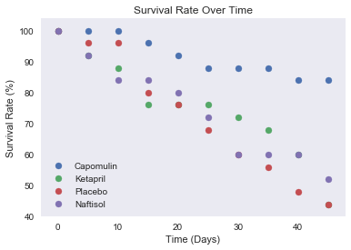


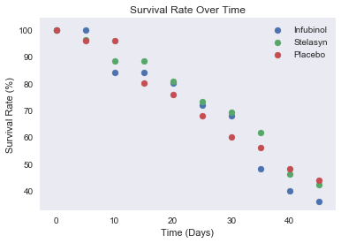


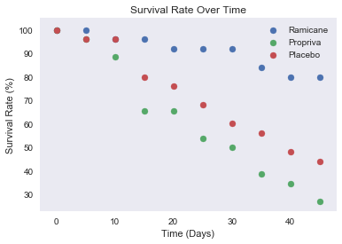


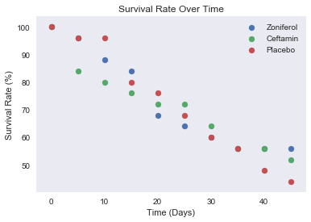


Again, Ramicane and Capomulin are the only drugs that appear to create better outcomes than the placebo.

## Percentage Tumor Volume Change Per Drug


```python
tumor_delta = pd.DataFrame(index = drugs, columns = ['% Change in Volume'])
tumor_delta['% Change in Volume'] = [(tumor_volume.iloc[9][drug]-tumor_volume.iloc[0][drug])/tumor_volume.iloc[0][drug] for drug in drugs]                        
                           
# it's true I could just use 45 instead of calling tumor_volume.iloc[0][drug] in my list comprehension
# I figure it's better programming

```


```python
tumor_delta = pd.DataFrame(index = drugs, columns = ['% Change in Volume'])
tumor_delta['% Change in Volume'] = [(tumor_volume.iloc[9][drug]-tumor_volume.iloc[0][drug])/tumor_volume.iloc[0][drug] for drug in drugs]                        
                           
# it's true I could just use 45 instead of calling tumor_volume.iloc[0][drug] in my list comprehension
# I figure it's better programming

plt.bar(tumor_delta.index, tumor_delta[tumor_delta > 0]['% Change in Volume']*100, color ='red')
plt.bar(tumor_delta.index, tumor_delta[tumor_delta < 0]['% Change in Volume']*100, color ='green')
plt.title('Tumor Volume Change')
plt.xlabel('Drug')
plt.ylabel("Volume Difference (%)")
sns.set_style('dark')
plt.xticks(rotation=45);

```


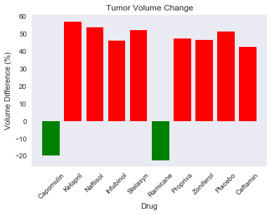


It appears that the only drugs that actually outperform the tumor are Capomulin and Ramicane. The rest have tumor volumes comparable to the placebo by the end of the trial.
